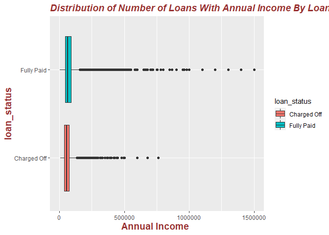
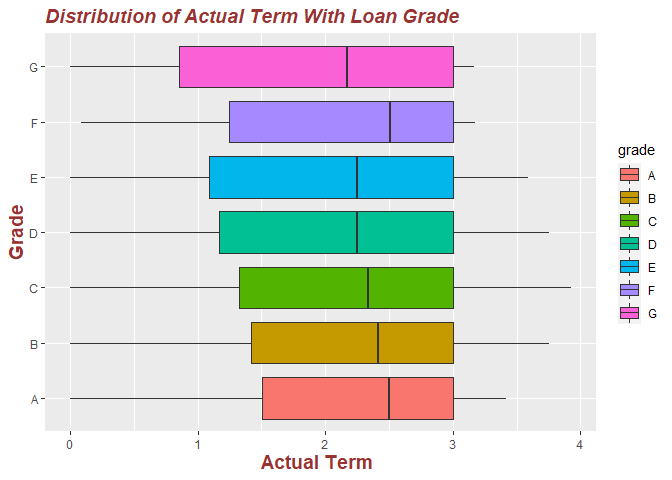

EDA-R
================
Shalaka Thakare
2022-11-27

Importing the Libraries

``` r
library(tidyverse)
```

    ## ── Attaching packages ─────────────────────────────────────── tidyverse 1.3.2 ──
    ## ✔ ggplot2 3.3.6      ✔ purrr   0.3.5 
    ## ✔ tibble  3.1.8      ✔ dplyr   1.0.10
    ## ✔ tidyr   1.2.1      ✔ stringr 1.4.1 
    ## ✔ readr   2.1.3      ✔ forcats 0.5.2 
    ## ── Conflicts ────────────────────────────────────────── tidyverse_conflicts() ──
    ## ✖ dplyr::filter() masks stats::filter()
    ## ✖ dplyr::lag()    masks stats::lag()

``` r
library(lubridate)
```

    ## 
    ## Attaching package: 'lubridate'
    ## 
    ## The following objects are masked from 'package:base':
    ## 
    ##     date, intersect, setdiff, union

``` r
library(stringr)
library(pROC)
```

    ## Type 'citation("pROC")' for a citation.
    ## 
    ## Attaching package: 'pROC'
    ## 
    ## The following objects are masked from 'package:stats':
    ## 
    ##     cov, smooth, var

``` r
library(rpart)
library(ROCR)
library(caret)
```

    ## Loading required package: lattice
    ## 
    ## Attaching package: 'caret'
    ## 
    ## The following object is masked from 'package:purrr':
    ## 
    ##     lift

``` r
library(ranger)
library(plotluck)
```

Loading the data…

``` r
lcdf <- read_csv('C:/Users/sthaka3/Desktop/Credit_Risk_Project/lcData100K.csv')
```

    ## Warning: One or more parsing issues, call `problems()` on your data frame for details,
    ## e.g.:
    ##   dat <- vroom(...)
    ##   problems(dat)

    ## Rows: 100000 Columns: 145
    ## ── Column specification ────────────────────────────────────────────────────────
    ## Delimiter: ","
    ## chr  (21): term, grade, sub_grade, emp_title, emp_length, home_ownership, ve...
    ## dbl  (84): loan_amnt, funded_amnt, funded_amnt_inv, int_rate, installment, a...
    ## lgl  (39): id, member_id, url, desc, next_pymnt_d, annual_inc_joint, dti_joi...
    ## dttm  (1): issue_d
    ## 
    ## ℹ Use `spec()` to retrieve the full column specification for this data.
    ## ℹ Specify the column types or set `show_col_types = FALSE` to quiet this message.

``` r
# Checking number of rows and columns in the lc dataframe 

cat('Number of rows = ', nrow(lcdf))
```

    ## Number of rows =  100000

``` r
cat('\nNumber of columns  = ',ncol(lcdf))
```

    ## 
    ## Number of columns  =  145

Exploring the data

``` r
head(lcdf)
```

    ## # A tibble: 6 × 145
    ##   id    member_id loan_amnt funded…¹ funde…² term  int_r…³ insta…⁴ grade sub_g…⁵
    ##   <lgl> <lgl>         <dbl>    <dbl>   <dbl> <chr>   <dbl>   <dbl> <chr> <chr>  
    ## 1 NA    NA            28000    28000   28000 36 m…    5.32    843. A     A1     
    ## 2 NA    NA             6150     6150    6125 36 m…   13.3     208. C     C3     
    ## 3 NA    NA             7200     7200    7200 36 m…   15.0     250. C     C5     
    ## 4 NA    NA             4750     4750    4750 36 m…   15.3     165. C     C4     
    ## 5 NA    NA             5000     5000    5000 36 m…   12.7     168. C     C2     
    ## 6 NA    NA             9600     9600    9600 36 m…   15.0     333. C     C3     
    ## # … with 135 more variables: emp_title <chr>, emp_length <chr>,
    ## #   home_ownership <chr>, annual_inc <dbl>, verification_status <chr>,
    ## #   issue_d <dttm>, loan_status <chr>, pymnt_plan <chr>, url <lgl>, desc <lgl>,
    ## #   purpose <chr>, title <chr>, zip_code <chr>, addr_state <chr>, dti <dbl>,
    ## #   delinq_2yrs <dbl>, earliest_cr_line <chr>, inq_last_6mths <dbl>,
    ## #   mths_since_last_delinq <dbl>, mths_since_last_record <dbl>, open_acc <dbl>,
    ## #   pub_rec <dbl>, revol_bal <dbl>, revol_util <dbl>, total_acc <dbl>, …

``` r
summary(lcdf)
```

    ##     id          member_id        loan_amnt      funded_amnt    funded_amnt_inv
    ##  Mode:logical   Mode:logical   Min.   : 1000   Min.   : 1000   Min.   :  925  
    ##  NA's:100000    NA's:100000    1st Qu.: 7000   1st Qu.: 7000   1st Qu.: 7000  
    ##                                Median :10000   Median :10000   Median :10000  
    ##                                Mean   :12736   Mean   :12736   Mean   :12731  
    ##                                3rd Qu.:17000   3rd Qu.:17000   3rd Qu.:16975  
    ##                                Max.   :35000   Max.   :35000   Max.   :35000  
    ##                                                                               
    ##      term              int_rate      installment         grade          
    ##  Length:100000      Min.   : 5.32   Min.   :  30.12   Length:100000     
    ##  Class :character   1st Qu.: 8.90   1st Qu.: 227.60   Class :character  
    ##  Mode  :character   Median :11.99   Median : 347.74   Mode  :character  
    ##                     Mean   :12.01   Mean   : 421.77                     
    ##                     3rd Qu.:14.47   3rd Qu.: 557.94                     
    ##                     Max.   :28.99   Max.   :1407.01                     
    ##                                                                         
    ##   sub_grade          emp_title          emp_length        home_ownership    
    ##  Length:100000      Length:100000      Length:100000      Length:100000     
    ##  Class :character   Class :character   Class :character   Class :character  
    ##  Mode  :character   Mode  :character   Mode  :character   Mode  :character  
    ##                                                                             
    ##                                                                             
    ##                                                                             
    ##                                                                             
    ##    annual_inc      verification_status    issue_d                      
    ##  Min.   :   3600   Length:100000       Min.   :2013-01-01 00:00:00.00  
    ##  1st Qu.:  43000   Class :character    1st Qu.:2014-04-01 00:00:00.00  
    ##  Median :  60600   Mode  :character    Median :2015-01-01 00:00:00.00  
    ##  Mean   :  73356                       Mean   :2014-10-29 08:24:51.83  
    ##  3rd Qu.:  89000                       3rd Qu.:2015-07-01 00:00:00.00  
    ##  Max.   :8500021                       Max.   :2015-12-01 00:00:00.00  
    ##                                                                        
    ##  loan_status         pymnt_plan          url            desc        
    ##  Length:100000      Length:100000      Mode:logical   Mode:logical  
    ##  Class :character   Class :character   NA's:100000    NA's:100000   
    ##  Mode  :character   Mode  :character                                
    ##                                                                     
    ##                                                                     
    ##                                                                     
    ##                                                                     
    ##    purpose             title             zip_code          addr_state       
    ##  Length:100000      Length:100000      Length:100000      Length:100000     
    ##  Class :character   Class :character   Class :character   Class :character  
    ##  Mode  :character   Mode  :character   Mode  :character   Mode  :character  
    ##                                                                             
    ##                                                                             
    ##                                                                             
    ##                                                                             
    ##       dti         delinq_2yrs      earliest_cr_line   inq_last_6mths 
    ##  Min.   : 0.00   Min.   : 0.0000   Length:100000      Min.   :0.000  
    ##  1st Qu.:11.63   1st Qu.: 0.0000   Class :character   1st Qu.:0.000  
    ##  Median :17.34   Median : 0.0000   Mode  :character   Median :0.000  
    ##  Mean   :17.91   Mean   : 0.3341                      Mean   :0.669  
    ##  3rd Qu.:23.81   3rd Qu.: 0.0000                      3rd Qu.:1.000  
    ##  Max.   :71.40   Max.   :21.0000                      Max.   :6.000  
    ##                                                                      
    ##  mths_since_last_delinq mths_since_last_record    open_acc    
    ##  Min.   :  0.00         Min.   :  0.00         Min.   : 0.00  
    ##  1st Qu.: 15.00         1st Qu.: 50.00         1st Qu.: 8.00  
    ##  Median : 31.00         Median : 69.00         Median :10.00  
    ##  Mean   : 33.94         Mean   : 69.54         Mean   :11.42  
    ##  3rd Qu.: 50.00         3rd Qu.: 91.00         3rd Qu.:14.00  
    ##  Max.   :188.00         Max.   :119.00         Max.   :79.00  
    ##  NA's   :49919          NA's   :82423                         
    ##     pub_rec          revol_bal        revol_util       total_acc     
    ##  Min.   : 0.0000   Min.   :     0   Min.   :  0.00   Min.   :  2.00  
    ##  1st Qu.: 0.0000   1st Qu.:  5896   1st Qu.: 36.20   1st Qu.: 16.00  
    ##  Median : 0.0000   Median : 10725   Median : 54.10   Median : 23.00  
    ##  Mean   : 0.2267   Mean   : 15795   Mean   : 53.75   Mean   : 24.76  
    ##  3rd Qu.: 0.0000   3rd Qu.: 18913   3rd Qu.: 71.80   3rd Qu.: 32.00  
    ##  Max.   :19.0000   Max.   :924579   Max.   :153.70   Max.   :162.00  
    ##                                     NA's   :41                       
    ##  initial_list_status   out_prncp out_prncp_inv  total_pymnt    total_pymnt_inv
    ##  Length:100000       Min.   :0   Min.   :0     Min.   :    0   Min.   :    0  
    ##  Class :character    1st Qu.:0   1st Qu.:0     1st Qu.: 6936   1st Qu.: 6935  
    ##  Mode  :character    Median :0   Median :0     Median :11471   Median :11470  
    ##                      Mean   :0   Mean   :0     Mean   :13790   Mean   :13785  
    ##                      3rd Qu.:0   3rd Qu.:0     3rd Qu.:18294   3rd Qu.:18290  
    ##                      Max.   :0   Max.   :0     Max.   :50941   Max.   :50941  
    ##                                                                               
    ##  total_rec_prncp total_rec_int     total_rec_late_fee   recoveries     
    ##  Min.   :    0   Min.   :    0.0   Min.   :   0.000   Min.   :    0.0  
    ##  1st Qu.: 6000   1st Qu.:  841.4   1st Qu.:   0.000   1st Qu.:    0.0  
    ##  Median :10000   Median : 1491.7   Median :   0.000   Median :    0.0  
    ##  Mean   :11757   Mean   : 1904.2   Mean   :   1.248   Mean   :  127.6  
    ##  3rd Qu.:16000   3rd Qu.: 2463.6   3rd Qu.:   0.000   3rd Qu.:    0.0  
    ##  Max.   :35000   Max.   :15871.0   Max.   :1098.360   Max.   :32321.3  
    ##                                                                        
    ##  collection_recovery_fee last_pymnt_d       last_pymnt_amnt   next_pymnt_d  
    ##  Min.   :   0.00         Length:100000      Min.   :    0.0   Mode:logical  
    ##  1st Qu.:   0.00         Class :character   1st Qu.:  327.8   NA's:100000   
    ##  Median :   0.00         Mode  :character   Median :  976.2                 
    ##  Mean   :  21.14                            Mean   : 3486.7                 
    ##  3rd Qu.:   0.00                            3rd Qu.: 4993.6                 
    ##  Max.   :4653.81                            Max.   :36058.7                 
    ##                                                                             
    ##  last_credit_pull_d collections_12_mths_ex_med mths_since_last_major_derog
    ##  Length:100000      Min.   :0.0000             Min.   :  0.00             
    ##  Class :character   1st Qu.:0.0000             1st Qu.: 26.00             
    ##  Mode  :character   Median :0.0000             Median : 43.00             
    ##                     Mean   :0.0167             Mean   : 43.01             
    ##                     3rd Qu.:0.0000             3rd Qu.: 60.00             
    ##                     Max.   :6.0000             Max.   :188.00             
    ##                                                NA's   :71995              
    ##   policy_code application_type   annual_inc_joint dti_joint     
    ##  Min.   :1    Length:100000      Mode:logical     Mode:logical  
    ##  1st Qu.:1    Class :character   NA's:100000      NA's:100000   
    ##  Median :1    Mode  :character                                  
    ##  Mean   :1                                                      
    ##  3rd Qu.:1                                                      
    ##  Max.   :1                                                      
    ##                                                                 
    ##  verification_status_joint acc_now_delinq     tot_coll_amt     
    ##  Mode:logical              Min.   :0.00000   Min.   :     0.0  
    ##  NA's:100000               1st Qu.:0.00000   1st Qu.:     0.0  
    ##                            Median :0.00000   Median :     0.0  
    ##                            Mean   :0.00577   Mean   :   232.8  
    ##                            3rd Qu.:0.00000   3rd Qu.:     0.0  
    ##                            Max.   :4.00000   Max.   :262740.0  
    ##                                                                
    ##   tot_cur_bal       open_acc_6m     open_act_il     open_il_12m   
    ##  Min.   :      0   Min.   : 0.00   Min.   : 0.00   Min.   :0.00   
    ##  1st Qu.:  25656   1st Qu.: 0.00   1st Qu.: 1.00   1st Qu.:0.00   
    ##  Median :  65143   Median : 1.00   Median : 2.00   Median :0.00   
    ##  Mean   : 128759   Mean   : 1.12   Mean   : 2.84   Mean   :0.73   
    ##  3rd Qu.: 191246   3rd Qu.: 2.00   3rd Qu.: 3.00   3rd Qu.:1.00   
    ##  Max.   :3292113   Max.   :10.00   Max.   :34.00   Max.   :7.00   
    ##                    NA's   :97313   NA's   :97313   NA's   :97313  
    ##   open_il_24m    mths_since_rcnt_il  total_bal_il       il_util     
    ##  Min.   : 0.00   Min.   :  0.0      Min.   :     0   Min.   :  0.0  
    ##  1st Qu.: 0.00   1st Qu.:  6.0      1st Qu.:  8864   1st Qu.: 57.0  
    ##  Median : 1.00   Median : 13.0      Median : 22032   Median : 74.0  
    ##  Mean   : 1.57   Mean   : 21.9      Mean   : 33728   Mean   : 70.8  
    ##  3rd Qu.: 2.00   3rd Qu.: 24.0      3rd Qu.: 43170   3rd Qu.: 88.0  
    ##  Max.   :13.00   Max.   :250.0      Max.   :561918   Max.   :192.0  
    ##  NA's   :97313   NA's   :97393      NA's   :97313    NA's   :97694  
    ##   open_rv_12m     open_rv_24m      max_bal_bc        all_util     
    ##  Min.   : 0.00   Min.   : 0.00   Min.   :     0   Min.   :  0.00  
    ##  1st Qu.: 0.00   1st Qu.: 1.00   1st Qu.:  2140   1st Qu.: 45.00  
    ##  Median : 1.00   Median : 2.00   Median :  4122   Median : 60.00  
    ##  Mean   : 1.43   Mean   : 3.04   Mean   :  5481   Mean   : 59.23  
    ##  3rd Qu.: 2.00   3rd Qu.: 4.00   3rd Qu.:  7082   3rd Qu.: 74.00  
    ##  Max.   :11.00   Max.   :24.00   Max.   :127305   Max.   :146.00  
    ##  NA's   :97313   NA's   :97313   NA's   :97313    NA's   :97313   
    ##  total_rev_hi_lim      inq_fi       total_cu_tl     inq_last_12m  
    ##  Min.   :      0   Min.   : 0.00   Min.   : 0.00   Min.   : 0.00  
    ##  1st Qu.:  12800   1st Qu.: 0.00   1st Qu.: 0.00   1st Qu.: 0.00  
    ##  Median :  22000   Median : 0.00   Median : 0.00   Median : 2.00  
    ##  Mean   :  30545   Mean   : 0.92   Mean   : 1.45   Mean   : 2.21  
    ##  3rd Qu.:  37500   3rd Qu.: 1.00   3rd Qu.: 2.00   3rd Qu.: 3.00  
    ##  Max.   :1165700   Max.   :13.00   Max.   :33.00   Max.   :18.00  
    ##                    NA's   :97313   NA's   :97313   NA's   :97313  
    ##  acc_open_past_24mths  avg_cur_bal     bc_open_to_buy      bc_util      
    ##  Min.   : 0.000       Min.   :     0   Min.   :     0   Min.   :  0.00  
    ##  1st Qu.: 2.000       1st Qu.:  2791   1st Qu.:  1203   1st Qu.: 42.30  
    ##  Median : 4.000       Median :  6312   Median :  3893   Median : 66.20  
    ##  Mean   : 4.396       Mean   : 12470   Mean   :  9046   Mean   : 62.45  
    ##  3rd Qu.: 6.000       3rd Qu.: 17267   3rd Qu.: 10602   3rd Qu.: 86.20  
    ##  Max.   :42.000       Max.   :395953   Max.   :332178   Max.   :188.80  
    ##                       NA's   :2        NA's   :964      NA's   :1044    
    ##  chargeoff_within_12_mths  delinq_amnt       mo_sin_old_il_acct
    ##  Min.   :0.00000          Min.   :    0.00   Min.   :  0       
    ##  1st Qu.:0.00000          1st Qu.:    0.00   1st Qu.: 96       
    ##  Median :0.00000          Median :    0.00   Median :128       
    ##  Mean   :0.01015          Mean   :   12.44   Mean   :125       
    ##  3rd Qu.:0.00000          3rd Qu.:    0.00   3rd Qu.:152       
    ##  Max.   :6.00000          Max.   :88216.00   Max.   :640       
    ##                                              NA's   :3620      
    ##  mo_sin_old_rev_tl_op mo_sin_rcnt_rev_tl_op mo_sin_rcnt_tl       mort_acc     
    ##  Min.   :  3.0        Min.   :  0.00        Min.   :  0.000   Min.   : 0.000  
    ##  1st Qu.:115.0        1st Qu.:  4.00        1st Qu.:  3.000   1st Qu.: 0.000  
    ##  Median :164.0        Median :  8.00        Median :  6.000   Median : 1.000  
    ##  Mean   :182.4        Mean   : 13.25        Mean   :  8.231   Mean   : 1.635  
    ##  3rd Qu.:231.0        3rd Qu.: 16.00        3rd Qu.: 10.000   3rd Qu.: 3.000  
    ##  Max.   :780.0        Max.   :293.00        Max.   :226.000   Max.   :25.000  
    ##                                                                               
    ##  mths_since_recent_bc mths_since_recent_bc_dlq mths_since_recent_inq
    ##  Min.   :  0.0        Min.   :  0.00           Min.   : 0.000       
    ##  1st Qu.:  6.0        1st Qu.: 21.00           1st Qu.: 2.000       
    ##  Median : 14.0        Median : 39.00           Median : 5.000       
    ##  Mean   : 24.5        Mean   : 39.98           Mean   : 6.908       
    ##  3rd Qu.: 29.0        3rd Qu.: 59.00           3rd Qu.:10.000       
    ##  Max.   :616.0        Max.   :176.00           Max.   :24.000       
    ##  NA's   :911          NA's   :74329            NA's   :10612        
    ##  mths_since_recent_revol_delinq num_accts_ever_120_pd num_actv_bc_tl  
    ##  Min.   :  0.00                 Min.   : 0.0000       Min.   : 0.000  
    ##  1st Qu.: 17.00                 1st Qu.: 0.0000       1st Qu.: 2.000  
    ##  Median : 33.00                 Median : 0.0000       Median : 3.000  
    ##  Mean   : 35.86                 Mean   : 0.4969       Mean   : 3.643  
    ##  3rd Qu.: 53.00                 3rd Qu.: 0.0000       3rd Qu.: 5.000  
    ##  Max.   :176.00                 Max.   :23.0000       Max.   :26.000  
    ##  NA's   :64746                                                        
    ##  num_actv_rev_tl   num_bc_sats       num_bc_tl        num_il_tl      
    ##  Min.   : 0.000   Min.   : 0.000   Min.   : 0.000   Min.   :  0.000  
    ##  1st Qu.: 3.000   1st Qu.: 3.000   1st Qu.: 5.000   1st Qu.:  3.000  
    ##  Median : 5.000   Median : 4.000   Median : 7.000   Median :  6.000  
    ##  Mean   : 5.673   Mean   : 4.653   Mean   : 8.297   Mean   :  8.085  
    ##  3rd Qu.: 7.000   3rd Qu.: 6.000   3rd Qu.:11.000   3rd Qu.: 11.000  
    ##  Max.   :41.000   Max.   :36.000   Max.   :61.000   Max.   :132.000  
    ##                                                                      
    ##  num_op_rev_tl   num_rev_accts   num_rev_tl_bal_gt_0    num_sats    
    ##  Min.   : 0.00   Min.   : 2.00   Min.   : 0.000      Min.   : 0.00  
    ##  1st Qu.: 5.00   1st Qu.: 9.00   1st Qu.: 3.000      1st Qu.: 8.00  
    ##  Median : 7.00   Median :13.00   Median : 5.000      Median :10.00  
    ##  Mean   : 8.16   Mean   :14.76   Mean   : 5.633      Mean   :11.37  
    ##  3rd Qu.:10.00   3rd Qu.:19.00   3rd Qu.: 7.000      3rd Qu.:14.00  
    ##  Max.   :67.00   Max.   :87.00   Max.   :36.000      Max.   :79.00  
    ##                  NA's   :1                                          
    ##  num_tl_120dpd_2m  num_tl_30dpd     num_tl_90g_dpd_24m num_tl_op_past_12m
    ##  Min.   :0.000    Min.   :0.00000   Min.   : 0.00000   Min.   : 0.000    
    ##  1st Qu.:0.000    1st Qu.:0.00000   1st Qu.: 0.00000   1st Qu.: 1.000    
    ##  Median :0.000    Median :0.00000   Median : 0.00000   Median : 2.000    
    ##  Mean   :0.001    Mean   :0.00383   Mean   : 0.09251   Mean   : 2.046    
    ##  3rd Qu.:0.000    3rd Qu.:0.00000   3rd Qu.: 0.00000   3rd Qu.: 3.000    
    ##  Max.   :2.000    Max.   :4.00000   Max.   :20.00000   Max.   :26.000    
    ##  NA's   :3824                                                            
    ##  pct_tl_nvr_dlq   percent_bc_gt_75 pub_rec_bankruptcies   tax_liens       
    ##  Min.   : 20.00   Min.   :  0.00   Min.   :0.0000       Min.   : 0.00000  
    ##  1st Qu.: 91.00   1st Qu.: 16.70   1st Qu.:0.0000       1st Qu.: 0.00000  
    ##  Median : 97.80   Median : 50.00   Median :0.0000       Median : 0.00000  
    ##  Mean   : 94.05   Mean   : 48.03   Mean   :0.1376       Mean   : 0.05683  
    ##  3rd Qu.:100.00   3rd Qu.: 75.00   3rd Qu.:0.0000       3rd Qu.: 0.00000  
    ##  Max.   :100.00   Max.   :100.00   Max.   :8.0000       Max.   :18.00000  
    ##  NA's   :16       NA's   :1034                                            
    ##  tot_hi_cred_lim   total_bal_ex_mort total_bc_limit  
    ##  Min.   :      0   Min.   :      0   Min.   :     0  
    ##  1st Qu.:  43247   1st Qu.:  18924   1st Qu.:  7000  
    ##  Median :  93904   Median :  34085   Median : 13600  
    ##  Mean   : 159185   Mean   :  45925   Mean   : 20179  
    ##  3rd Qu.: 229283   3rd Qu.:  57457   3rd Qu.: 26000  
    ##  Max.   :3647089   Max.   :1067947   Max.   :332200  
    ##                                                      
    ##  total_il_high_credit_limit revol_bal_joint sec_app_earliest_cr_line
    ##  Min.   :      0            Mode:logical    Mode:logical            
    ##  1st Qu.:  12142            NA's:100000     NA's:100000             
    ##  Median :  28353                                                    
    ##  Mean   :  38086                                                    
    ##  3rd Qu.:  51262                                                    
    ##  Max.   :1027358                                                    
    ##                                                                     
    ##  sec_app_inq_last_6mths sec_app_mort_acc sec_app_open_acc sec_app_revol_util
    ##  Mode:logical           Mode:logical     Mode:logical     Mode:logical      
    ##  NA's:100000            NA's:100000      NA's:100000      NA's:100000       
    ##                                                                             
    ##                                                                             
    ##                                                                             
    ##                                                                             
    ##                                                                             
    ##  sec_app_open_act_il sec_app_num_rev_accts sec_app_chargeoff_within_12_mths
    ##  Mode:logical        Mode:logical          Mode:logical                    
    ##  NA's:100000         NA's:100000           NA's:100000                     
    ##                                                                            
    ##                                                                            
    ##                                                                            
    ##                                                                            
    ##                                                                            
    ##  sec_app_collections_12_mths_ex_med sec_app_mths_since_last_major_derog
    ##  Mode:logical                       Mode:logical                       
    ##  NA's:100000                        NA's:100000                        
    ##                                                                        
    ##                                                                        
    ##                                                                        
    ##                                                                        
    ##                                                                        
    ##  hardship_flag      hardship_type  hardship_reason hardship_status
    ##  Length:100000      Mode:logical   Mode:logical    Mode:logical   
    ##  Class :character   NA's:100000    NA's:100000     NA's:100000    
    ##  Mode  :character                                                 
    ##                                                                   
    ##                                                                   
    ##                                                                   
    ##                                                                   
    ##  deferral_term  hardship_amount hardship_start_date hardship_end_date
    ##  Mode:logical   Mode:logical    Mode:logical        Mode:logical     
    ##  NA's:100000    NA's:100000     NA's:100000         NA's:100000      
    ##                                                                      
    ##                                                                      
    ##                                                                      
    ##                                                                      
    ##                                                                      
    ##  payment_plan_start_date hardship_length hardship_dpd    hardship_loan_status
    ##  Mode:logical            Mode:logical    Mode :logical   Mode:logical        
    ##  NA's:100000             NA's:100000     FALSE:45        NA's:100000         
    ##                                          NA's :99955                         
    ##                                                                              
    ##                                                                              
    ##                                                                              
    ##                                                                              
    ##  orig_projected_additional_accrued_interest hardship_payoff_balance_amount
    ##  Mode:logical                               Mode:logical                  
    ##  NA's:100000                                NA's:100000                   
    ##                                                                           
    ##                                                                           
    ##                                                                           
    ##                                                                           
    ##                                                                           
    ##  hardship_last_payment_amount disbursement_method debt_settlement_flag
    ##  Mode:logical                 Length:100000       Length:100000       
    ##  NA's:100000                  Class :character    Class :character    
    ##                               Mode  :character    Mode  :character    
    ##                                                                       
    ##                                                                       
    ##                                                                       
    ##                                                                       
    ##  debt_settlement_flag_date settlement_status settlement_date settlement_amount
    ##  Mode:logical              Mode:logical      Mode:logical    Mode:logical     
    ##  NA's:100000               NA's:100000       NA's:100000     NA's:100000      
    ##                                                                               
    ##                                                                               
    ##                                                                               
    ##                                                                               
    ##                                                                               
    ##  settlement_percentage settlement_term
    ##  Mode:logical          Mode :logical  
    ##  NA's:100000           FALSE:279      
    ##                        TRUE :186      
    ##                        NA's :99535    
    ##                                       
    ##                                       
    ## 

How many different types of loan status exist in the data?

``` r
lcdf %>% group_by(loan_status) %>% tally()
```

    ## # A tibble: 2 × 2
    ##   loan_status     n
    ##   <chr>       <int>
    ## 1 Charged Off 13785
    ## 2 Fully Paid  86215

Looks like our target variable- loan_status has only 2 values- Charged
Off and Fully Paid.

Let’s check the distribution of loan status across all records

``` r
loan_status_count <- lcdf %>% group_by(loan_status) %>% count()
pct <- round(loan_status_count$n/sum(loan_status_count$n)*100)
lbls <- paste(loan_status_count$loan_status, pct) # add percents to labels
lbls <- paste(lbls,"%",sep="") # ad % to labels


pie(loan_status_count$n, labels = lbls, main="Percentage of Loans with Loan Status")
```

<!-- -->

Analyzing Home Ownerships

``` r
ggplot(lcdf, aes( x = home_ownership)) + geom_bar(colour="black", fill="white") +ggtitle("Number of Loans By Homeownerships") + xlab("Different Types of Homeownership") + ylab("Number of Loans ") + theme(plot.title = element_text(color="#993333", size=14, face="bold.italic"), axis.title.x = element_text(color="#993333", size=14, face="bold"), axis.title.y = element_text(color="#993333", size=14, face="bold")) 
```

<!-- -->

We can see that most of the borrowers have their home on rent or
mortgage as compared to those who own their homes.

Let’s now visualize the spread of interest rate to get a better
understanding of the given data

``` r
summary(lcdf$int_rate)
```

    ##    Min. 1st Qu.  Median    Mean 3rd Qu.    Max. 
    ##    5.32    8.90   11.99   12.01   14.47   28.99

``` r
ggplot(lcdf, aes( x = int_rate)) + geom_boxplot(color="#993333",outlier.color = "black") + 
xlab("Interest Rate ")  + theme(plot.title = element_text(color="#993333", size=14, face="bold.italic"), axis.title.x = element_text(color="#993333", size=14, face="bold"), axis.title.y = element_text(color="#993333", size=14, face="bold")) 
```

<!-- -->

<font > 25 Percentile of loans have an interest rate of less than 8.9%.
Median of the interest rate of all loans in 11.99%. The interest rate
can go as high as 28.99 % in some case. This interest seems really
active to invest in. Very few investment products give an interest of
12%. </font>

Let’s understand interest rates vary according to loan grade

``` r
ggplot(lcdf, aes( y = int_rate, x=grade,color= grade)) + geom_boxplot(outlier.color="black") + xlab("Loan grade ") +
ylab("Interest Rate")  + theme(plot.title = element_text(color="#993333", size=14, face="bold.italic"), axis.title.x = element_text(color="#993333", size=14, face="bold"), axis.title.y = element_text(color="#993333", size=14, face="bold")) 
```

<!-- -->

We can see that the median interest rate increases as we go from grade A
to grade G, probably due to higher risk.

Let’s summarize the data to check percent of defaults using loan status
for all loan grades

``` r
lcdf %>% group_by(grade) %>% summarise(TotalLoans=n(), FullyPaid=sum(loan_status=="Fully Paid"), ChargedOff=sum(loan_status=="Charged Off"), Percent_defaults = ChargedOff/TotalLoans*100)
```

    ## # A tibble: 7 × 5
    ##   grade TotalLoans FullyPaid ChargedOff Percent_defaults
    ##   <chr>      <int>     <int>      <int>            <dbl>
    ## 1 A          22588     21401       1187             5.26
    ## 2 B          33907     30184       3723            11.0 
    ## 3 C          26645     21907       4738            17.8 
    ## 4 D          12493      9635       2858            22.9 
    ## 5 E           3579      2569       1010            28.2 
    ## 6 F            708       469        239            33.8 
    ## 7 G             80        50         30            37.5

The percent of default loans is higher for lower grade loans. This
explains why interest rates are higher for the same.

Now, let’s look at a wider picture to see how number of loans, loan
amount, interest rate vary by grade. First, lets do some calculations

``` r
# Number of Loans, Sum of Loan Amout, Mean Loan Amount Mean Int Rate by Grade
lcdf %>% group_by(grade) %>% summarise(numberOfLoans=n(), TotLoanAmt=sum(loan_amnt),MeanLoanAmt=mean(loan_amnt),defaults=sum(loan_status=="Charged Off"), defaultRate=defaults/numberOfLoans, Percent_defaults = defaultRate*100,MeanIntRate=mean(int_rate),stdInterest=sd(int_rate), minInt = min(int_rate),maxInt=max(int_rate),avgLoanAMt=mean(loan_amnt), sumPmnt=sum(total_pymnt),avgPmnt=mean(total_pymnt))
```

    ## # A tibble: 7 × 14
    ##   grade numberO…¹ TotLo…² MeanL…³ defau…⁴ defau…⁵ Perce…⁶ MeanI…⁷ stdIn…⁸ minInt
    ##   <chr>     <int>   <dbl>   <dbl>   <int>   <dbl>   <dbl>   <dbl>   <dbl>  <dbl>
    ## 1 A         22588  3.28e8  14505.    1187  0.0526    5.26    7.17   0.967   5.32
    ## 2 B         33907  4.28e8  12637.    3723  0.110    11.0    10.8    1.44    6   
    ## 3 C         26645  3.20e8  12001.    4738  0.178    17.8    13.8    1.19    6   
    ## 4 D         12493  1.49e8  11894.    2858  0.229    22.9    17.2    1.22    6   
    ## 5 E          3579  4.16e7  11619.    1010  0.282    28.2    19.9    1.38    6   
    ## 6 F           708  6.56e6   9272.     239  0.338    33.8    24.0    0.916  22.0 
    ## 7 G            80  9.46e5  11826.      30  0.375    37.5    26.4    0.849  25.8 
    ## # … with 4 more variables: maxInt <dbl>, avgLoanAMt <dbl>, sumPmnt <dbl>,
    ## #   avgPmnt <dbl>, and abbreviated variable names ¹​numberOfLoans, ²​TotLoanAmt,
    ## #   ³​MeanLoanAmt, ⁴​defaults, ⁵​defaultRate, ⁶​Percent_defaults, ⁷​MeanIntRate,
    ## #   ⁸​stdInterest

``` r
# Loan Amount Distribution
ggplot(lcdf, aes( x = loan_amnt)) + geom_histogram(aes(y=..density..), colour="black", fill="white", bins=15)+ geom_density(alpha=.2, fill="#FF6666") +  ggtitle("Distribution of Loan Amount Changing Bins ") + xlab("Loan Amount ") + ylab("Number of Loans ") + theme(plot.title = element_text(color="#993333", size=14, face="bold.italic"), axis.title.x = element_text(color="#993333", size=14, face="bold"), axis.title.y = element_text(color="#993333", size=14, face="bold")) 
```

<!-- -->

<font> The loan amount varies from 0 to 35,000. The number of charged
off loans are less in overall number,which is evident in the graph. In
an ideal case these would have been normally distributed.There are loans
which are higher than 30,000 and still paid.Also, there are loans of
less than 10,000 and charged off. This means that loan status has more
to do with loan grade rather than the loan amount. </font>

``` r
# Loan Amount Distribution by Grade 

ggplot(lcdf, aes( x = loan_amnt)) + geom_histogram(aes(fill=grade)) +  ggtitle("Distribution of Loan Amount With Grade") + xlab("Loan Amount ") + ylab("Number of Loans ") + theme(plot.title = element_text(color="#993333", size=14, face="bold.italic"), axis.title.x = element_text(color="#993333", size=14, face="bold"), axis.title.y = element_text(color="#993333", size=14, face="bold")) 
```

    ## `stat_bin()` using `bins = 30`. Pick better value with `binwidth`.

<!-- -->

The loan amount for most loans is approximately \$12000.Loan amount is
lower for lower grade loans.Let’s dive deeper into the relationship with
loan amount and loan grade.

``` r
# Let us look at the distribution

ggplot(lcdf, aes( y = loan_amnt, x=grade,color= grade)) + geom_boxplot(outlier.color="black") + xlab("Loan grade ") +
ylab("Loan Amount")  + theme(plot.title = element_text(color="#993333", size=14, face="bold.italic"), axis.title.x = element_text(color="#993333", size=14, face="bold"), axis.title.y = element_text(color="#993333", size=14, face="bold")) 
```

<!-- -->

We can see that loans falling under A and B grades have higher loan
amounts, while those for C, D, E and F are slightly lesser.Range for
loan amounts with Grade G have a broader range.

``` r
# Interest Rate with Grade 
ggplot(lcdf, aes( x = int_rate)) + geom_histogram(aes(fill=grade)) + ggtitle("Distribution of Interest Rate With Grade") + xlab("Interest Rate ") + ylab("Number of Loans ") + theme(plot.title = element_text(color="#993333", size=14, face="bold.italic"), axis.title.x = element_text(color="#993333", size=14, face="bold"), axis.title.y = element_text(color="#993333", size=14, face="bold")) 
```

    ## `stat_bin()` using `bins = 30`. Pick better value with `binwidth`.

<!-- -->

<font> We can see that the average interest rate is higher in higher
grades of loans. Higher interest rates can mean higher returns for
investors, but this also means higher risk. Interest rates vary from 0
to 28 percent. Most loans have an interest rate of 12-14%.</font>

Let’s analyze the data with respect to purpose of loans

``` r
table(lcdf$purpose)
```

    ## 
    ##                car        credit_card debt_consolidation   home_improvement 
    ##                928              24989              57622               5654 
    ##              house     major_purchase            medical             moving 
    ##                354               1823               1119                691 
    ##              other   renewable_energy     small_business           vacation 
    ##               5091                 58                893                678 
    ##            wedding 
    ##                100

``` r
# Checking number of loans by purpose 

lcdf$purpose <- as.character(lcdf$purpose )
lcdf$purpose  <- str_trim(lcdf$purpose )
lcdf$purpose  <- as.factor(lcdf$purpose )


  
lcdf$purpose <- fct_collapse(lcdf$purpose, other = c("wedding","renewable_energy", "other"),NULL = "H")


# Get the number of loans by loan purpose 

ggplot(data = lcdf, aes(x = purpose)) + geom_bar() + ggtitle("Number of Loans By Purpose") + xlab("Purpose of Loan ") + ylab("Number of Loans ")+ theme(plot.title = element_text(color="#993333", size=14, face="bold.italic"), axis.title.x = element_text(color="#993333", size=14, face="bold"), axis.title.y = element_text(color="#993333", size=14, face="bold")) + theme(axis.text.x = element_text(angle = 90, vjust = 0.5, hjust=1))
```

<!-- -->

``` r
#Plot of loan amount by purpose


ggplot(lcdf, aes( x = loan_amnt, y=purpose)) + geom_boxplot(aes(fill=purpose)) + 
xlab("Loan Amount ") + ylab("Purpose of Each Loan ") + theme(plot.title = element_text(color="#993333", size=14, face="bold.italic"), axis.title.x = element_text(color="#993333", size=14, face="bold"), axis.title.y = element_text(color="#993333", size=14, face="bold")) 
```

<!-- -->

``` r
#Bivariate analysis of employment length and purpose. 
table(lcdf$purpose, lcdf$emp_length)
```

    ##                     
    ##                      < 1 year 1 year 10+ years 2 years 3 years 4 years 5 years
    ##   car                     104     67       245      90      85      52      70
    ##   credit_card            2260   1726      7366    2323    2078    1485    1463
    ##   debt_consolidation     4489   3838     18435    5136    4588    3402    3500
    ##   home_improvement        302    285      2104     432     386     314     365
    ##   house                    41     22        81      43      37      21      31
    ##   major_purchase          149    108       506     191     189     125     118
    ##   medical                  87     72       374     109      92      53      63
    ##   moving                  148     60       116      82      59      46      45
    ##   other                   436    366      1655     449     405     300     290
    ##   small_business           59     64       270      77      87      64      57
    ##   vacation                 29     41       242      55      40      30      44
    ##                     
    ##                      6 years 7 years 8 years 9 years   n/a
    ##   car                     42      42      50      26    55
    ##   credit_card           1237    1255    1213     962  1621
    ##   debt_consolidation    2622    3015    2940    2331  3326
    ##   home_improvement       265     275     288     215   423
    ##   house                   18      20      19       8    13
    ##   major_purchase          95      95      71      69   107
    ##   medical                 46      52      59      38    74
    ##   moving                  24      28      24      13    46
    ##   other                  270     253     243     176   406
    ##   small_business          52      52      45      36    30
    ##   vacation                41      37      38      34    47

``` r
# Percentages 

lcdf %>% group_by(purpose) %>% summarise(nLoans=n(), defaults=sum(loan_status=="Charged Off"), Default_per = (defaults/nLoans)*100)
```

    ## # A tibble: 11 × 4
    ##    purpose            nLoans defaults Default_per
    ##    <fct>               <int>    <int>       <dbl>
    ##  1 car                   928      107        11.5
    ##  2 credit_card         24989     2865        11.5
    ##  3 debt_consolidation  57622     8319        14.4
    ##  4 home_improvement     5654      682        12.1
    ##  5 house                 354       63        17.8
    ##  6 major_purchase       1823      266        14.6
    ##  7 medical              1119      172        15.4
    ##  8 moving                691      144        20.8
    ##  9 other                5249      863        16.4
    ## 10 small_business        893      203        22.7
    ## 11 vacation              678      101        14.9

``` r
#Does loan-grade vary by purpose? Which pupose the loan grade fall in?

table(lcdf$purpose, lcdf$grade)
```

    ##                     
    ##                          A     B     C     D     E     F     G
    ##   car                  253   306   238    92    27     8     4
    ##   credit_card         8349  9809  5008  1518   266    37     2
    ##   debt_consolidation 11573 19745 16497  7534  1954   292    27
    ##   home_improvement    1457  1777  1496   673   215    33     3
    ##   house                 37    74    83    74    48    27    11
    ##   major_purchase       441   553   479   252    70    26     2
    ##   medical               84   270   382   251    97    34     1
    ##   moving                10    96   207   234   108    32     4
    ##   other                327  1050  1749  1385   576   144    18
    ##   small_business        15   100   249   300   159    62     8
    ##   vacation              42   127   257   180    59    13     0

``` r
#do those with home-improvement loans own or rent a home?  
lcdf %>% group_by(home_ownership) %>% summarise(nLoans=n(), purpose_home_ownership=sum(purpose=="home_improvement"))
```

    ## # A tibble: 3 × 3
    ##   home_ownership nLoans purpose_home_ownership
    ##   <chr>           <int>                  <int>
    ## 1 MORTGAGE        46988                   4282
    ## 2 OWN             10437                    909
    ## 3 RENT            42575                    463

More than half (58 %) of loans were taken for debt consolidation. This
follows the the Pareto principle of 80:20 rule, as the top 3 purposes
are more than 80% of loan purposes. While the most number of loans are
for the purpose of debt consolidation/credit card, the maximum percent
of defaults are found to be for the purpose of small businesses, moving
and housing loan. Most credit card and debt consolidation loans fall
under grade B, small business loan mostly fall under grade D and moving
under grade C. People with 10 + years of experience are the most common
borrower of loan for credit card and debt consolidation. Home
improvement loans are more common with 10+ years of experience.car loans
are more common with people having 2 years of experience. Which might be
reflective of the fact that once people are in job for 2 years they
would want to keep a car for which they come to the lending club. Other
than this, there are several people taking loans for home improvement
when their Home ownership status says that they are living on rent. This
seems suspicious because rarely will a tenant issue a loan for
improvement.

Now that we understand purpose of loans with other factors, let’s check
the relationship between employment length and other variables

``` r
# Arranging emp_length as factor variables 
lcdf$emp_length <- factor(lcdf$emp_length, levels=c("n/a", "< 1 year","1 year","2 years", "3 years" ,  "4 years",   "5 years",   "6 years",   "7 years" ,  "8 years", "9 years", "10+ years" ))

# Number of loans in each employment length 
ggplot(data = lcdf, aes(x = emp_length)) + geom_bar() + ggtitle("Number of Loans in Each Employement Length ") + xlab("Employement Length ") + ylab("Number of Loans ")+ theme(plot.title = element_text(color="#993333", size=14, face="bold.italic"), axis.title.x = element_text(color="#993333", size=14, face="bold"), axis.title.y = element_text(color="#993333", size=14, face="bold")) 
```

<!-- -->

``` r
# Results in a table

table(lcdf$loan_status, lcdf$emp_length)
```

    ##              
    ##                 n/a < 1 year 1 year 2 years 3 years 4 years 5 years 6 years
    ##   Charged Off  1296     1204    960    1206    1088     775     841     632
    ##   Fully Paid   4852     6900   5689    7781    6958    5117    5205    4080
    ##              
    ##               7 years 8 years 9 years 10+ years
    ##   Charged Off     712     698     522      3851
    ##   Fully Paid     4412    4292    3386     27543

``` r
# Calculating the proportion of defaults across employment length


lcdf %>% group_by(emp_length) %>% summarise(nLoans=n(), defaults=sum(loan_status=="Charged Off"), defaultPercentage=defaults/nLoans*100, avgIntRate=mean(int_rate),  avgLoanAmt=mean(loan_amnt)) 
```

    ## # A tibble: 12 × 6
    ##    emp_length nLoans defaults defaultPercentage avgIntRate avgLoanAmt
    ##    <fct>       <int>    <int>             <dbl>      <dbl>      <dbl>
    ##  1 n/a          6148     1296              21.1       12.6     10152.
    ##  2 < 1 year     8104     1204              14.9       12.1     12171.
    ##  3 1 year       6649      960              14.4       12.2     12137.
    ##  4 2 years      8987     1206              13.4       12.1     12252.
    ##  5 3 years      8046     1088              13.5       12.0     12433.
    ##  6 4 years      5892      775              13.2       12.0     12556.
    ##  7 5 years      6046      841              13.9       12.1     12658.
    ##  8 6 years      4712      632              13.4       12.2     12589.
    ##  9 7 years      5124      712              13.9       12.2     12563.
    ## 10 8 years      4990      698              14.0       11.9     13029.
    ## 11 9 years      3908      522              13.4       12.0     13077.
    ## 12 10+ years   31394     3851              12.3       11.8     13741.

``` r
# Plot for Distribution of Loan Amount with Employment Length

ggplot(lcdf, aes( x = loan_amnt, y=emp_length)) + geom_boxplot(aes(fill=emp_length)) + 
xlab("Loan Amount ") + ylab("Employment Length ")+ggtitle("Distribution of Loan Amount with Employement Length") + theme(plot.title = element_text(color="#993333", size=14, face="bold.italic"), axis.title.x = element_text(color="#993333", size=14, face="bold"), axis.title.y = element_text(color="#993333", size=14, face="bold")) 
```

<!-- -->

Checking for Outliers

``` r
#Look at the variable summaries -- focus on a subset of the variables of interest in your analyses & modeling


#lcdf %>% select_if(is.numeric) %>% summary() 


# Let us look at the annual income 

ggplot(lcdf, aes( x = annual_inc)) +  geom_histogram(aes(y=..density..), colour="black", fill="white")+ geom_density(alpha=.2, fill="#FF6666") +  ggtitle("Distribution of Number of Loans With Annual Income ") + xlab("Annual Income ") + ylab("Number of Loans  ") + theme(plot.title = element_text(color="#993333", size=14, face="bold.italic"), axis.title.x = element_text(color="#993333", size=14, face="bold"), axis.title.y = element_text(color="#993333", size=14, face="bold")) 
```

    ## `stat_bin()` using `bins = 30`. Pick better value with `binwidth`.

<!-- -->

``` r
# Let us check how are these very high income associated with loans status 

ggplot(lcdf, aes( x = annual_inc, y=loan_status)) + geom_boxplot(aes(fill=loan_status)) +  ggtitle("Distribution of Number of Loans With Annual Income By Loan Status - Before Removing Extreme Outliers") + xlab("Annual Income ") +  theme(plot.title = element_text(color="#993333", size=14, face="bold.italic"), axis.title.x = element_text(color="#993333", size=14, face="bold"), axis.title.y = element_text(color="#993333", size=14, face="bold")) 
```

<!-- -->

<font> For annual income the data seems to be skewed towards the left.
very few borrowers have an income more than 1.5 Milliion. It would be
rare occurrence for someone to have an income more than 1.5 million and
issue a loan from lending club, so we could consider these data points
as outliers. Hence we will remove these 9 observations, which make up a
very small percent of all the records in the dataset, therefore the
impact would be next to negligible. </font>

<font> The very high income cases are for paid-off loans. We could
exclude them, however we do so we might not have a decision tree model
which predicts the hypothesis that high income people pay off the loan
in most cases.Going with the use case we will discard and keep them in a
separate dataframe.We shall observe what difference it makes to out
models in the later part. Compared to the 110k data size the number
looks really small, hence we will remove these </font>

Removing Outliers….

``` r
lcdf <- lcdf %>% filter(annual_inc <= 1500000)

# Let us look at the new distribution of annual income after outlier removal 

ggplot(lcdf, aes( x = annual_inc, y=loan_status)) + geom_boxplot(aes(fill=loan_status)) +  ggtitle("Distribution of Number of Loans With Annual Income By Loan Status - After Removing Extreme Outliers ") + xlab("Annual Income ") +  theme(plot.title = element_text(color="#993333", size=14, face="bold.italic"), axis.title.x = element_text(color="#993333", size=14, face="bold"), axis.title.y = element_text(color="#993333", size=14, face="bold")) 
```

<!-- -->

Now that we have removed the data points over 1.5 million, our data
looks much cleaner but outliers still exist.Although, if we would remove
the data points above the upper bound(by multiplying the IQR by 1.5), we
would have lost essential data.

Let’s calculate annual returns

``` r
# Let us look at some columns 

lcdf %>% select(loan_status, int_rate, funded_amnt, total_pymnt) %>% head()
```

    ## # A tibble: 6 × 4
    ##   loan_status int_rate funded_amnt total_pymnt
    ##   <chr>          <dbl>       <dbl>       <dbl>
    ## 1 Fully Paid      5.32       28000      29437.
    ## 2 Fully Paid     13.3         6150       7311.
    ## 3 Fully Paid     15.0         7200       8972.
    ## 4 Fully Paid     15.3         4750       5611.
    ## 5 Fully Paid     12.7         5000       6009.
    ## 6 Fully Paid     15.0         9600      11748.

``` r
# We will use the following to calculate annualized return 
#annReturn = [(Total Payment  - funded amount)/funded amount]*12/36*100

lcdf$annRet <- ((lcdf$total_pymnt -lcdf$funded_amnt)/lcdf$funded_amnt)*(12/36)*100

# Returns for charged off and fully paid loans 
lcdf  %>% group_by(loan_status) %>% summarise(avgRet=mean(annRet), stdRet=sd(annRet), minRet=min(annRet), maxRet=max(annRet))
```

    ## # A tibble: 2 × 5
    ##   loan_status avgRet stdRet minRet maxRet
    ##   <chr>        <dbl>  <dbl>  <dbl>  <dbl>
    ## 1 Charged Off -12.0    9.27  -33.3   13.7
    ## 2 Fully Paid    5.12   2.42    0     16.5

``` r
# Do charged off loans have negative returns - 

lcdf %>% select(loan_status, int_rate, funded_amnt, total_pymnt, annRet) %>% filter(annRet < 0) %>% count(loan_status)
```

    ## # A tibble: 1 × 2
    ##   loan_status     n
    ##   <chr>       <int>
    ## 1 Charged Off 12145

We can see that the minimum returns for charged off loans can be as low
as 0. This could be because borrowers are paying off their loans much
earlier than expected. Maximum returns from fully paid loans could be as
high as 16.5%, which cannot be possiblefor high grade loans. While
chances of the loan being fully paid are higher for higher grade loans,
investors might consider investing in lower grade loans for higher
returns.

Let’s further analyze exactly how early or late are the loans being
paid?

``` r
head(lcdf[, c("last_pymnt_d", "issue_d")])
```

    ## # A tibble: 6 × 2
    ##   last_pymnt_d issue_d            
    ##   <chr>        <dttm>             
    ## 1 Jul-2016     2015-05-01 00:00:00
    ## 2 Jun-2017     2015-07-01 00:00:00
    ## 3 Nov-2017     2014-11-01 00:00:00
    ## 4 Aug-2015     2014-03-01 00:00:00
    ## 5 Nov-2017     2015-04-01 00:00:00
    ## 6 Mar-2016     2014-01-01 00:00:00

``` r
# Bringing them to a consistent format 
lcdf$last_pymnt_d<-paste(lcdf$last_pymnt_d, "-01", sep = "")
lcdf$last_pymnt_d<-parse_date_time(lcdf$last_pymnt_d,  "myd")
```

    ## Warning: 64 failed to parse.

``` r
#Check their format now
head(lcdf[, c("last_pymnt_d", "issue_d")])
```

    ## # A tibble: 6 × 2
    ##   last_pymnt_d        issue_d            
    ##   <dttm>              <dttm>             
    ## 1 2016-07-01 00:00:00 2015-05-01 00:00:00
    ## 2 2017-06-01 00:00:00 2015-07-01 00:00:00
    ## 3 2017-11-01 00:00:00 2014-11-01 00:00:00
    ## 4 2015-08-01 00:00:00 2014-03-01 00:00:00
    ## 5 2017-11-01 00:00:00 2015-04-01 00:00:00
    ## 6 2016-03-01 00:00:00 2014-01-01 00:00:00

``` r
# Creating actual term column - If loan is charged off by default - 3 years 
lcdf$actualTerm <- ifelse(lcdf$loan_status=="Fully Paid", as.duration(lcdf$issue_d  %--% lcdf$last_pymnt_d)/dyears(1), 3)

# We know using simple interest Total =  principle + pnr/100
# Hence r = (Total - principle)/principle * 100/n

# Then, considering this actual term, the actual annual return is

lcdf$actualReturn <- ifelse(lcdf$actualTerm>0, ((lcdf$total_pymnt -lcdf$funded_amnt)/lcdf$funded_amnt)*(1/lcdf$actualTerm)*100, 0)

lcdf %>% select(loan_status, int_rate, funded_amnt, total_pymnt, annRet, actualTerm, issue_d,last_pymnt_d) %>%  head()
```

    ## # A tibble: 6 × 8
    ##   loan_status int_rate funded_amnt total_py…¹ annRet actua…² issue_d            
    ##   <chr>          <dbl>       <dbl>      <dbl>  <dbl>   <dbl> <dttm>             
    ## 1 Fully Paid      5.32       28000     29437.   1.71    1.17 2015-05-01 00:00:00
    ## 2 Fully Paid     13.3         6150      7311.   6.29    1.92 2015-07-01 00:00:00
    ## 3 Fully Paid     15.0         7200      8972.   8.20    3.00 2014-11-01 00:00:00
    ## 4 Fully Paid     15.3         4750      5611.   6.04    1.42 2014-03-01 00:00:00
    ## 5 Fully Paid     12.7         5000      6009.   6.73    2.59 2015-04-01 00:00:00
    ## 6 Fully Paid     15.0         9600     11748.   7.46    2.16 2014-01-01 00:00:00
    ## # … with 1 more variable: last_pymnt_d <dttm>, and abbreviated variable names
    ## #   ¹​total_pymnt, ²​actualTerm

``` r
# Checking the same for charged off loans 
lcdf %>% select(loan_status, int_rate, funded_amnt, total_pymnt, annRet, actualTerm, actualReturn) %>% filter(loan_status=="Charged Off") %>% head()
```

    ## # A tibble: 6 × 7
    ##   loan_status int_rate funded_amnt total_pymnt annRet actualTerm actualReturn
    ##   <chr>          <dbl>       <dbl>       <dbl>  <dbl>      <dbl>        <dbl>
    ## 1 Charged Off     16.0        8000       5936.  -8.60          3        -8.60
    ## 2 Charged Off     13.7       27500       4704. -27.6           3       -27.6 
    ## 3 Charged Off     16.5       11625       6543. -14.6           3       -14.6 
    ## 4 Charged Off     13.0        5600       6114.   3.06          3         3.06
    ## 5 Charged Off     16.6        3500       3711.   2.01          3         2.01
    ## 6 Charged Off     12.0       25000       7314. -23.6           3       -23.6

Let’s find out actual return with respect to actual term.

``` r
# For cost-based performance, we may want to see the average interest rate, and the average of proportion of loan amount paid back, grouped by loan_status

lcdf%>% group_by(loan_status) %>% summarise(  meanintRate=mean(int_rate), meanRet=mean((total_pymnt-funded_amnt)/funded_amnt),meanRetPer=mean((total_pymnt-funded_amnt)/funded_amnt)*100, sumTotalpymt = sum(total_pymnt), sumFundedamnt = sum(funded_amnt), term=mean(actualTerm)  )
```

    ## # A tibble: 2 × 7
    ##   loan_status meanintRate meanRet meanRetPer sumTotalpymt sumFundedamnt  term
    ##   <chr>             <dbl>   <dbl>      <dbl>        <dbl>         <dbl> <dbl>
    ## 1 Charged Off        13.9  -0.359      -35.9   107801040.     168999125  3   
    ## 2 Fully Paid         11.7   0.154       15.4  1271091404.    1104497150  2.13

``` r
# Checking the same by grade along with loan status

lcdf%>% group_by(loan_status, grade) %>% summarise(  intRate=mean(int_rate),meanRet=mean((total_pymnt-funded_amnt)/funded_amnt),
meanRetPer=mean((total_pymnt-funded_amnt)/funded_amnt)*100,sumTotalpymt = sum(total_pymnt), sumFundedamnt = sum(funded_amnt), term=mean(actualTerm)   )
```

    ## `summarise()` has grouped output by 'loan_status'. You can override using the
    ## `.groups` argument.

    ## # A tibble: 14 × 8
    ## # Groups:   loan_status [2]
    ##    loan_status grade intRate meanRet meanRetPer sumTotalpymt sumFundedamnt  term
    ##    <chr>       <chr>   <dbl>   <dbl>      <dbl>        <dbl>         <dbl> <dbl>
    ##  1 Charged Off A        7.44 -0.347      -34.7     10551097.      16182850  3   
    ##  2 Charged Off B       10.9  -0.346      -34.6     30252911.      46221175  3   
    ##  3 Charged Off C       13.9  -0.359      -35.9     36394725.      57214150  3   
    ##  4 Charged Off D       17.2  -0.371      -37.1     21511774.      34618525  3   
    ##  5 Charged Off E       19.8  -0.381      -38.1      7390448.      12117275  3   
    ##  6 Charged Off F       24.1  -0.357      -35.7      1534358.       2344325  3   
    ##  7 Charged Off G       26.4  -0.432      -43.2       165728.        300825  3   
    ##  8 Fully Paid  A        7.16  0.0951       9.51   341332406.     311443175  2.20
    ##  9 Fully Paid  B       10.7   0.142       14.2    436933918.     382261400  2.15
    ## 10 Fully Paid  C       13.8   0.181       18.1    310248814.     262517900  2.09
    ## 11 Fully Paid  D       17.2   0.222       22.2    139263468.     113957300  2.03
    ## 12 Fully Paid  E       20.0   0.257       25.7     36885764.      29451525  2.01
    ## 13 Fully Paid  F       23.9   0.319       31.9      5581142.       4220600  2.09
    ## 14 Fully Paid  G       26.4   0.318       31.8       845893.        645250  1.91

``` r
# For Fully Paid loans, is the average value of totRet what you'd expect, considering the average value for intRate?


lcdf %>% group_by(loan_status) %>% summarise(avgInt=mean(int_rate), avgRet=mean(actualReturn),avgTerm=mean(actualTerm))
```

    ## # A tibble: 2 × 4
    ##   loan_status avgInt avgRet avgTerm
    ##   <chr>        <dbl>  <dbl>   <dbl>
    ## 1 Charged Off   13.9 -12.0     3   
    ## 2 Fully Paid    11.7   8.02    2.13

``` r
ggplot(lcdf, aes( x = actualReturn)) + geom_histogram(aes(fill=grade)) + ggtitle("Distribution of Actual Returns With Grade") + xlab("Actual Return ") + ylab("Number of Loans ") + theme(plot.title = element_text(color="#993333", size=14, face="bold.italic"), axis.title.x = element_text(color="#993333", size=14, face="bold"), axis.title.y = element_text(color="#993333", size=14, face="bold")) 
```

    ## `stat_bin()` using `bins = 30`. Pick better value with `binwidth`.

<!-- -->

We can see that the actual term is not 3 years for fully paid loans.
This could be the reason why returns are lower than expected. Charged
off loans are expected to have negative return irrespective of the
grade. Higher graded have higher loss / negative mean return rate.

Let’s check distribution of actual term

``` r
ggplot(lcdf %>% filter(loan_status=='Fully Paid'), aes( x = actualTerm)) + geom_histogram(aes(y=..density..), colour="black", fill="white", bins=50) +ggtitle("Distribution of Actual Term ") + xlab("Actual Term ") + ylab("Number of Loans ") + theme(plot.title = element_text(color="#993333", size=14, face="bold.italic"), axis.title.x = element_text(color="#993333", size=14, face="bold"), axis.title.y = element_text(color="#993333", size=14, face="bold")) 
```

<!-- -->

``` r
ggplot(lcdf %>% filter(loan_status=='Fully Paid'), aes( x = actualTerm, y=grade)) + geom_boxplot(aes(fill=grade)) + ggtitle("Distribution of Actual Term With Loan Grade ")+
xlab("Actual Term ") + ylab("Grade") + theme(plot.title = element_text(color="#993333", size=14, face="bold.italic"), axis.title.x = element_text(color="#993333", size=14, face="bold"), axis.title.y = element_text(color="#993333", size=14, face="bold")) 
```

<!-- -->

Derived attributes

``` r
lcdf$propSatisBankcardAccts <- ifelse(lcdf$num_bc_tl>0, lcdf$num_bc_sats/lcdf$num_bc_tl, 0)
 
# Let us look at the column created 

summary(lcdf$propSatisBankcardAccts)
```

    ##    Min. 1st Qu.  Median    Mean 3rd Qu.    Max. 
    ##  0.0000  0.4286  0.6000  0.6161  0.8000  1.0000

``` r
# Plot 
ggplot(lcdf, aes( x = propSatisBankcardAccts, y=loan_status)) + geom_boxplot(aes(fill=loan_status)) + ggtitle("Distribution of Proportion of Satisfactory Bank Cards") +
xlab("Proportion of Satisfactory Bank Cards ") + ylab(" Loan Status ") + theme(plot.title = element_text(color="#993333", size=14, face="bold.italic"), axis.title.x = element_text(color="#993333", size=14, face="bold"), axis.title.y = element_text(color="#993333", size=14, face="bold")) 
```

<!-- -->

``` r
#Another one - lets calculate the length of borrower's history 

#  i.e time between earliest_cr_line - open of current credit line. The month the borrowers earliers 
# issue_d 

# Correcting the date format 
lcdf$earliest_cr_line<-paste(lcdf$earliest_cr_line, "-01", sep = "")

lcdf$earliest_cr_line<-parse_date_time(lcdf$earliest_cr_line, "myd")

lcdf$earliest_cr_line %>% head()
```

    ## [1] "1994-12-01 UTC" "1988-04-01 UTC" "1988-08-01 UTC" "1984-02-01 UTC"
    ## [5] "2000-07-01 UTC" "2005-01-01 UTC"

``` r
lcdf$borrHistory <- as.duration(lcdf$earliest_cr_line %--% lcdf$issue_d  ) / dyears(1)


ggplot(lcdf, aes( x = borrHistory, y=loan_status)) + geom_boxplot(aes(fill=loan_status)) + 
xlab("Borrower History in Years ") + ylab("Loan Status")+ggtitle("Distribution of Borrower History") + theme(plot.title = element_text(color="#993333", size=14, face="bold.italic"), axis.title.x = element_text(color="#993333", size=14, face="bold"), axis.title.y = element_text(color="#993333", size=14, face="bold")) 
```

<!-- -->

``` r
#Another new attribute: ratio of openAccounts to totalAccounts


lcdf$openAccRatio <- ifelse(lcdf$total_acc>0, lcdf$open_acc/lcdf$total_acc, 0)


summary(lcdf$openAccRatio)
```

    ##    Min. 1st Qu.  Median    Mean 3rd Qu.    Max. 
    ##  0.0000  0.3704  0.4800  0.5014  0.6154  1.0000

``` r
 #   Min. 1st Qu.  Median    Mean 3rd Qu.    Max. 
 # 0.0000  0.3704  0.4815  0.5017  0.6154  1.0000 
 
ggplot(lcdf, aes( x = openAccRatio)) + geom_boxplot(aes(fill=loan_status)) + 
xlab("Proportion of Open Account to Total Accounts ") + ylab(" Loan Status ") + theme(plot.title = element_text(color="#993333", size=14, face="bold.italic"), axis.title.x = element_text(color="#993333", size=14, face="bold"), axis.title.y = element_text(color="#993333", size=14, face="bold")) 
```

<!-- -->

``` r
#does LC-assigned loan grade vary by borrHistory?

lcdf %>% group_by(grade) %>% summarise(avgBorrHist=mean(borrHistory))
```

    ## # A tibble: 7 × 2
    ##   grade avgBorrHist
    ##   <chr>       <dbl>
    ## 1 A            18.2
    ## 2 B            16.7
    ## 3 C            15.5
    ## 4 D            14.9
    ## 5 E            14.4
    ## 6 F            13.5
    ## 7 G            11.4

``` r
ggplot(lcdf, aes( x = borrHistory)) + geom_boxplot(aes(fill=grade)) + 
xlab("Borrower History ") + ylab(" Loan Status ") + theme(plot.title = element_text(color="#993333", size=14, face="bold.italic"), axis.title.x = element_text(color="#993333", size=14, face="bold"), axis.title.y = element_text(color="#993333", size=14, face="bold")) 
```

<!-- -->

``` r
lcdf %>% group_by(grade) %>% summarise(avgBorrHist=mean(borrHistory), minBorrHist=min(borrHistory), maxBorrHist = max(borrHistory), medianBorrHist=median(borrHistory)) 
```

    ## # A tibble: 7 × 5
    ##   grade avgBorrHist minBorrHist maxBorrHist medianBorrHist
    ##   <chr>       <dbl>       <dbl>       <dbl>          <dbl>
    ## 1 A            18.2        3.08        57.6           16.5
    ## 2 B            16.7        3.00        65.0           15.1
    ## 3 C            15.5        3.08        63.8           14.2
    ## 4 D            14.9        3.08        64             13.6
    ## 5 E            14.4        3.08        58.3           13.1
    ## 6 F            13.5        3.08        51.4           12.2
    ## 7 G            11.4        3.16        26.3           10.9

Converting character variables

``` r
#glimpse(lcdf)

#  there are a few character type variables - grade, sub_grade, verification_status,....
#   We can  convert all of these to factor

lcdf <- lcdf %>% mutate_if(is.character, as.factor)

#Checking the datatype after conversion 

#glimpse(lcdf)
```

Data Leakage Concept of leakage - It is the use of information in the
model training process which would not be expected to be available at
prediction time, causing the predictive scores (metrics) to overestimate
the model’s utility when run in a production environment.Reference -
<https://en.wikipedia.org/wiki/Leakage_(machine_learning)#>:\~:text=In%20statistics%20and%20machine%20learning,when%20run%20in%20a%20production</font>

``` r
#Identified the variables you want to remove

varsToRemove = c('funded_amnt_inv', 'term', 'emp_title', 'pymnt_plan', 'earliest_cr_line', 'title', 'zip_code', 'addr_state', 'out_prncp', 'out_prncp_inv', 'total_pymnt_inv', 'total_rec_prncp', 'total_rec_int', 'total_rec_late_fee', 'recoveries', 'collection_recovery_fee', 'last_credit_pull_d', 'policy_code', 'disbursement_method', 'debt_settlement_flag',  'settlement_term', 'application_type')

lcdf <- lcdf %>% select(-all_of(varsToRemove))  

#Drop all the variables with names starting with "hardship" -- as they can cause leakage, unknown at the time when the loan was given.

#First checking before dropping

lcdf %>% select(starts_with("hardship")) 
```

    ## # A tibble: 99,994 × 12
    ##    hardship_flag hards…¹ hards…² hards…³ hards…⁴ hards…⁵ hards…⁶ hards…⁷ hards…⁸
    ##    <fct>         <lgl>   <lgl>   <lgl>   <lgl>   <lgl>   <lgl>   <lgl>   <lgl>  
    ##  1 N             NA      NA      NA      NA      NA      NA      NA      NA     
    ##  2 N             NA      NA      NA      NA      NA      NA      NA      NA     
    ##  3 N             NA      NA      NA      NA      NA      NA      NA      NA     
    ##  4 N             NA      NA      NA      NA      NA      NA      NA      NA     
    ##  5 N             NA      NA      NA      NA      NA      NA      NA      NA     
    ##  6 N             NA      NA      NA      NA      NA      NA      NA      NA     
    ##  7 N             NA      NA      NA      NA      NA      NA      NA      NA     
    ##  8 N             NA      NA      NA      NA      NA      NA      NA      NA     
    ##  9 N             NA      NA      NA      NA      NA      NA      NA      NA     
    ## 10 N             NA      NA      NA      NA      NA      NA      NA      NA     
    ## # … with 99,984 more rows, 3 more variables: hardship_loan_status <lgl>,
    ## #   hardship_payoff_balance_amount <lgl>, hardship_last_payment_amount <lgl>,
    ## #   and abbreviated variable names ¹​hardship_type, ²​hardship_reason,
    ## #   ³​hardship_status, ⁴​hardship_amount, ⁵​hardship_start_date,
    ## #   ⁶​hardship_end_date, ⁷​hardship_length, ⁸​hardship_dpd

``` r
# Dropping 

lcdf <- lcdf %>% select(-starts_with("hardship"))

#similarly, all variable starting with "settlement", these are happening after disbursement 

lcdf %>% select(starts_with('settlement'))
```

    ## # A tibble: 99,994 × 4
    ##    settlement_status settlement_date settlement_amount settlement_percentage
    ##    <lgl>             <lgl>           <lgl>             <lgl>                
    ##  1 NA                NA              NA                NA                   
    ##  2 NA                NA              NA                NA                   
    ##  3 NA                NA              NA                NA                   
    ##  4 NA                NA              NA                NA                   
    ##  5 NA                NA              NA                NA                   
    ##  6 NA                NA              NA                NA                   
    ##  7 NA                NA              NA                NA                   
    ##  8 NA                NA              NA                NA                   
    ##  9 NA                NA              NA                NA                   
    ## 10 NA                NA              NA                NA                   
    ## # … with 99,984 more rows

``` r
# 4 columns 

#Dropping them

lcdf <- lcdf %>% select(-starts_with("settlement"))

# Additional Leakage variables - based on our understanding 


varsToRemove2 <- c("last_pymnt_d", "last_pymnt_amnt", "issue_d",'next_pymnt_d', 'deferral_term', 'payment_plan_start_date', 'debt_settlement_flag_date'  )


# last_pymnt_d, last_pymnt_amnt, next_pymnt_d, deferral_term, payment_plan_start_date, debt_settlement_flag_date  

lcdf <- lcdf %>% select(-all_of(varsToRemove2))
```

Understanding the leakage is very important in the concept of Data
Mining where we will be going ahead to predict models based on the
training data. The models will be well trained if we use the leakage
variable, however when we get unseen set of data the prediction will be
poor as they wont be having values of these variables

Missing Values

Potential reasons for missing values in different variables? Are some of
the missing values actually ‘zeros’ which are not recorded in the data?
Is missing-ness informative in some way? Are there, for example,
more/less defaults for cases where values on the attribute are missing

``` r
# Dropping columns with all n/a

lcdf %>% select_if(function(x){  all(is.na(x)) } ) # Checking what are those columns 
```

    ## # A tibble: 99,994 × 19
    ##    id    member_id url   desc  annual_…¹ dti_j…² verif…³ revol…⁴ sec_a…⁵ sec_a…⁶
    ##    <lgl> <lgl>     <lgl> <lgl> <lgl>     <lgl>   <lgl>   <lgl>   <lgl>   <lgl>  
    ##  1 NA    NA        NA    NA    NA        NA      NA      NA      NA      NA     
    ##  2 NA    NA        NA    NA    NA        NA      NA      NA      NA      NA     
    ##  3 NA    NA        NA    NA    NA        NA      NA      NA      NA      NA     
    ##  4 NA    NA        NA    NA    NA        NA      NA      NA      NA      NA     
    ##  5 NA    NA        NA    NA    NA        NA      NA      NA      NA      NA     
    ##  6 NA    NA        NA    NA    NA        NA      NA      NA      NA      NA     
    ##  7 NA    NA        NA    NA    NA        NA      NA      NA      NA      NA     
    ##  8 NA    NA        NA    NA    NA        NA      NA      NA      NA      NA     
    ##  9 NA    NA        NA    NA    NA        NA      NA      NA      NA      NA     
    ## 10 NA    NA        NA    NA    NA        NA      NA      NA      NA      NA     
    ## # … with 99,984 more rows, 9 more variables: sec_app_mort_acc <lgl>,
    ## #   sec_app_open_acc <lgl>, sec_app_revol_util <lgl>,
    ## #   sec_app_open_act_il <lgl>, sec_app_num_rev_accts <lgl>,
    ## #   sec_app_chargeoff_within_12_mths <lgl>,
    ## #   sec_app_collections_12_mths_ex_med <lgl>,
    ## #   sec_app_mths_since_last_major_derog <lgl>,
    ## #   orig_projected_additional_accrued_interest <lgl>, and abbreviated …

``` r
lcdf <- lcdf %>% select_if(function(x){ ! all(is.na(x)) } ) # Dropping

# Finding names of columns which has atleast 1 missing values 


names(lcdf)[colSums(is.na(lcdf)) > 0] 
```

    ##  [1] "mths_since_last_delinq"         "mths_since_last_record"        
    ##  [3] "revol_util"                     "mths_since_last_major_derog"   
    ##  [5] "open_acc_6m"                    "open_act_il"                   
    ##  [7] "open_il_12m"                    "open_il_24m"                   
    ##  [9] "mths_since_rcnt_il"             "total_bal_il"                  
    ## [11] "il_util"                        "open_rv_12m"                   
    ## [13] "open_rv_24m"                    "max_bal_bc"                    
    ## [15] "all_util"                       "inq_fi"                        
    ## [17] "total_cu_tl"                    "inq_last_12m"                  
    ## [19] "avg_cur_bal"                    "bc_open_to_buy"                
    ## [21] "bc_util"                        "mo_sin_old_il_acct"            
    ## [23] "mths_since_recent_bc"           "mths_since_recent_bc_dlq"      
    ## [25] "mths_since_recent_inq"          "mths_since_recent_revol_delinq"
    ## [27] "num_rev_accts"                  "num_tl_120dpd_2m"              
    ## [29] "pct_tl_nvr_dlq"                 "percent_bc_gt_75"

``` r
# Finding proportion 

options(scipen=999) # To not use scientific notation 

colMeans(is.na(lcdf))[colMeans(is.na(lcdf))>0] 
```

    ##         mths_since_last_delinq         mths_since_last_record 
    ##                   0.4992199532                   0.8242294538 
    ##                     revol_util    mths_since_last_major_derog 
    ##                   0.0004100246                   0.7199531972 
    ##                    open_acc_6m                    open_act_il 
    ##                   0.9731283877                   0.9731283877 
    ##                    open_il_12m                    open_il_24m 
    ##                   0.9731283877                   0.9731283877 
    ##             mths_since_rcnt_il                   total_bal_il 
    ##                   0.9739284357                   0.9731283877 
    ##                        il_util                    open_rv_12m 
    ##                   0.9769386163                   0.9731283877 
    ##                    open_rv_24m                     max_bal_bc 
    ##                   0.9731283877                   0.9731283877 
    ##                       all_util                         inq_fi 
    ##                   0.9731283877                   0.9731283877 
    ##                    total_cu_tl                   inq_last_12m 
    ##                   0.9731283877                   0.9731283877 
    ##                    avg_cur_bal                 bc_open_to_buy 
    ##                   0.0000200012                   0.0096405784 
    ##                        bc_util             mo_sin_old_il_acct 
    ##                   0.0104406264                   0.0361921715 
    ##           mths_since_recent_bc       mths_since_recent_bc_dlq 
    ##                   0.0091105466                   0.7433145989 
    ##          mths_since_recent_inq mths_since_recent_revol_delinq 
    ##                   0.1061263676                   0.6474888493 
    ##                  num_rev_accts               num_tl_120dpd_2m 
    ##                   0.0000100006                   0.0382422945 
    ##                 pct_tl_nvr_dlq               percent_bc_gt_75 
    ##                   0.0001600096                   0.0103406204

``` r
# Finding the columns which have more than 60% missing values 

names(lcdf)[colMeans(is.na(lcdf))>0.6]
```

    ##  [1] "mths_since_last_record"         "mths_since_last_major_derog"   
    ##  [3] "open_acc_6m"                    "open_act_il"                   
    ##  [5] "open_il_12m"                    "open_il_24m"                   
    ##  [7] "mths_since_rcnt_il"             "total_bal_il"                  
    ##  [9] "il_util"                        "open_rv_12m"                   
    ## [11] "open_rv_24m"                    "max_bal_bc"                    
    ## [13] "all_util"                       "inq_fi"                        
    ## [15] "total_cu_tl"                    "inq_last_12m"                  
    ## [17] "mths_since_recent_bc_dlq"       "mths_since_recent_revol_delinq"

``` r
nm<-names(lcdf)[colMeans(is.na(lcdf))>0.6]
lcdf <- lcdf %>% select(-all_of(nm))

#Impute missing values for remaining variables which have missing values
# - first get the columns with missing values

colMeans(is.na(lcdf))[colMeans(is.na(lcdf))>0]
```

    ## mths_since_last_delinq             revol_util            avg_cur_bal 
    ##           0.4992199532           0.0004100246           0.0000200012 
    ##         bc_open_to_buy                bc_util     mo_sin_old_il_acct 
    ##           0.0096405784           0.0104406264           0.0361921715 
    ##   mths_since_recent_bc  mths_since_recent_inq          num_rev_accts 
    ##           0.0091105466           0.1061263676           0.0000100006 
    ##       num_tl_120dpd_2m         pct_tl_nvr_dlq       percent_bc_gt_75 
    ##           0.0382422945           0.0001600096           0.0103406204

``` r
nm<- names(lcdf)[colSums(is.na(lcdf))>0]

summary(lcdf[, nm])
```

    ##  mths_since_last_delinq   revol_util      avg_cur_bal     bc_open_to_buy  
    ##  Min.   :  0.00         Min.   :  0.00   Min.   :     0   Min.   :     0  
    ##  1st Qu.: 15.00         1st Qu.: 36.20   1st Qu.:  2791   1st Qu.:  1203  
    ##  Median : 31.00         Median : 54.10   Median :  6311   Median :  3893  
    ##  Mean   : 33.94         Mean   : 53.75   Mean   : 12469   Mean   :  9046  
    ##  3rd Qu.: 50.00         3rd Qu.: 71.80   3rd Qu.: 17266   3rd Qu.: 10602  
    ##  Max.   :188.00         Max.   :153.70   Max.   :395953   Max.   :332178  
    ##  NA's   :49919          NA's   :41       NA's   :2        NA's   :964     
    ##     bc_util       mo_sin_old_il_acct mths_since_recent_bc mths_since_recent_inq
    ##  Min.   :  0.00   Min.   :  0        Min.   :  0.0        Min.   : 0.000       
    ##  1st Qu.: 42.30   1st Qu.: 96        1st Qu.:  6.0        1st Qu.: 2.000       
    ##  Median : 66.20   Median :128        Median : 14.0        Median : 5.000       
    ##  Mean   : 62.45   Mean   :125        Mean   : 24.5        Mean   : 6.908       
    ##  3rd Qu.: 86.20   3rd Qu.:152        3rd Qu.: 29.0        3rd Qu.:10.000       
    ##  Max.   :188.80   Max.   :640        Max.   :616.0        Max.   :24.000       
    ##  NA's   :1044     NA's   :3619       NA's   :911          NA's   :10612        
    ##  num_rev_accts   num_tl_120dpd_2m pct_tl_nvr_dlq   percent_bc_gt_75
    ##  Min.   : 2.00   Min.   :0.000    Min.   : 20.00   Min.   :  0.00  
    ##  1st Qu.: 9.00   1st Qu.:0.000    1st Qu.: 91.00   1st Qu.: 16.70  
    ##  Median :13.00   Median :0.000    Median : 97.80   Median : 50.00  
    ##  Mean   :14.76   Mean   :0.001    Mean   : 94.05   Mean   : 48.03  
    ##  3rd Qu.:19.00   3rd Qu.:0.000    3rd Qu.:100.00   3rd Qu.: 75.00  
    ##  Max.   :87.00   Max.   :2.000    Max.   :100.00   Max.   :100.00  
    ##  NA's   :1       NA's   :3824     NA's   :16       NA's   :1034

``` r
# Replacing values - adding median values 

lcdf<- lcdf %>% replace_na(list(mths_since_last_delinq=median(lcdf$mths_since_last_delinq, na.rm=TRUE), bc_open_to_buy=median(lcdf$bc_open_to_buy, na.rm=TRUE), mo_sin_old_il_acct=median(lcdf$mo_sin_old_il_acct,na.rm=TRUE), mths_since_recent_bc=median(lcdf$mths_since_recent_bc, na.rm=TRUE), mths_since_recent_inq=5, num_tl_120dpd_2m = median(lcdf$num_tl_120dpd_2m, na.rm=TRUE),percent_bc_gt_75 = median(lcdf$percent_bc_gt_75, na.rm=TRUE), bc_util=median(lcdf$bc_util, na.rm=TRUE) ))


lcdf<- lcdf %>% mutate_if(is.numeric,  ~ifelse(is.na(.x), median(.x, na.rm = TRUE), .x))


dim(lcdf) 
```

    ## [1] 99994    69

Some columns have same percentage of missing values. This could be
because they are dependent columns. Information source for one column
could also the source of other columns could be the reason. These
missing values can be because of the following - 1. Missing Completely
at Random 2. Missing at Random 3. Missing Not At Random. We could use
various techniques taught in class to impute these missing values. 1.
Imputing values 2. Leaving those rows. However approach for each column
can be different. We could use various techniques taught in class to
impute these missing values. 1. Imputing values 2. Leaving those rows.
However approach for each column can be different. If they do not relate
well to larger values, than we should not assume that missings are for
values higher than the max.We will remove columns with more than 60%
missing values, this is taken as a trial and test way - However when it
comes to removing columns with NA approach could be different in each
case. This could also mean loss of very important variable. We can tune
our model based on the results

Next, we can perform a Univariate Analysis to understand exactly Which
variables are individually predictive of the outcome

``` r
aucAll<- sapply(lcdf %>% mutate_if(is.factor, as.numeric) %>% select_if(is.numeric), auc, response=lcdf$loan_status) 
```

    ## Setting levels: control = Charged Off, case = Fully Paid

    ## Setting direction: controls < cases

    ## Setting levels: control = Charged Off, case = Fully Paid

    ## Setting direction: controls < cases

    ## Setting levels: control = Charged Off, case = Fully Paid

    ## Setting direction: controls > cases

    ## Setting levels: control = Charged Off, case = Fully Paid

    ## Setting direction: controls < cases

    ## Setting levels: control = Charged Off, case = Fully Paid

    ## Setting direction: controls > cases

    ## Setting levels: control = Charged Off, case = Fully Paid

    ## Setting direction: controls > cases

    ## Setting levels: control = Charged Off, case = Fully Paid

    ## Setting direction: controls < cases

    ## Setting levels: control = Charged Off, case = Fully Paid

    ## Setting direction: controls > cases

    ## Setting levels: control = Charged Off, case = Fully Paid

    ## Setting direction: controls < cases

    ## Setting levels: control = Charged Off, case = Fully Paid

    ## Setting direction: controls < cases

    ## Setting levels: control = Charged Off, case = Fully Paid

    ## Setting direction: controls < cases

    ## Setting levels: control = Charged Off, case = Fully Paid

    ## Setting direction: controls < cases

    ## Setting levels: control = Charged Off, case = Fully Paid

    ## Setting direction: controls > cases

    ## Setting levels: control = Charged Off, case = Fully Paid

    ## Setting direction: controls < cases

    ## Setting levels: control = Charged Off, case = Fully Paid

    ## Setting direction: controls > cases

    ## Setting levels: control = Charged Off, case = Fully Paid

    ## Setting direction: controls < cases

    ## Setting levels: control = Charged Off, case = Fully Paid

    ## Setting direction: controls > cases

    ## Setting levels: control = Charged Off, case = Fully Paid

    ## Setting direction: controls < cases

    ## Setting levels: control = Charged Off, case = Fully Paid

    ## Setting direction: controls < cases

    ## Setting levels: control = Charged Off, case = Fully Paid

    ## Setting direction: controls > cases

    ## Setting levels: control = Charged Off, case = Fully Paid

    ## Setting direction: controls < cases

    ## Setting levels: control = Charged Off, case = Fully Paid

    ## Setting direction: controls < cases

    ## Setting levels: control = Charged Off, case = Fully Paid

    ## Setting direction: controls < cases

    ## Setting levels: control = Charged Off, case = Fully Paid

    ## Setting direction: controls < cases

    ## Setting levels: control = Charged Off, case = Fully Paid

    ## Setting direction: controls < cases

    ## Setting levels: control = Charged Off, case = Fully Paid

    ## Setting direction: controls < cases

    ## Setting levels: control = Charged Off, case = Fully Paid

    ## Setting direction: controls < cases

    ## Setting levels: control = Charged Off, case = Fully Paid

    ## Setting direction: controls < cases

    ## Setting levels: control = Charged Off, case = Fully Paid

    ## Setting direction: controls > cases

    ## Setting levels: control = Charged Off, case = Fully Paid

    ## Setting direction: controls < cases

    ## Setting levels: control = Charged Off, case = Fully Paid

    ## Setting direction: controls < cases

    ## Setting levels: control = Charged Off, case = Fully Paid

    ## Setting direction: controls > cases

    ## Setting levels: control = Charged Off, case = Fully Paid

    ## Setting direction: controls < cases

    ## Setting levels: control = Charged Off, case = Fully Paid

    ## Setting direction: controls < cases

    ## Setting levels: control = Charged Off, case = Fully Paid

    ## Setting direction: controls < cases

    ## Setting levels: control = Charged Off, case = Fully Paid

    ## Setting direction: controls < cases

    ## Setting levels: control = Charged Off, case = Fully Paid

    ## Setting direction: controls < cases

    ## Setting levels: control = Charged Off, case = Fully Paid

    ## Setting direction: controls < cases

    ## Setting levels: control = Charged Off, case = Fully Paid

    ## Setting direction: controls < cases

    ## Setting levels: control = Charged Off, case = Fully Paid

    ## Setting direction: controls < cases

    ## Setting levels: control = Charged Off, case = Fully Paid

    ## Setting direction: controls < cases

    ## Setting levels: control = Charged Off, case = Fully Paid

    ## Setting direction: controls < cases

    ## Setting levels: control = Charged Off, case = Fully Paid

    ## Setting direction: controls < cases

    ## Setting levels: control = Charged Off, case = Fully Paid

    ## Setting direction: controls < cases

    ## Setting levels: control = Charged Off, case = Fully Paid

    ## Setting direction: controls < cases

    ## Setting levels: control = Charged Off, case = Fully Paid

    ## Setting direction: controls < cases

    ## Setting levels: control = Charged Off, case = Fully Paid

    ## Setting direction: controls < cases

    ## Setting levels: control = Charged Off, case = Fully Paid

    ## Setting direction: controls > cases

    ## Setting levels: control = Charged Off, case = Fully Paid

    ## Setting direction: controls < cases

    ## Setting levels: control = Charged Off, case = Fully Paid

    ## Setting direction: controls < cases

    ## Setting levels: control = Charged Off, case = Fully Paid

    ## Setting direction: controls > cases

    ## Setting levels: control = Charged Off, case = Fully Paid

    ## Setting direction: controls < cases

    ## Setting levels: control = Charged Off, case = Fully Paid

    ## Setting direction: controls < cases

    ## Setting levels: control = Charged Off, case = Fully Paid

    ## Setting direction: controls < cases

    ## Setting levels: control = Charged Off, case = Fully Paid

    ## Setting direction: controls < cases

    ## Setting levels: control = Charged Off, case = Fully Paid

    ## Setting direction: controls < cases

    ## Setting levels: control = Charged Off, case = Fully Paid

    ## Setting direction: controls < cases

    ## Setting levels: control = Charged Off, case = Fully Paid

    ## Setting direction: controls < cases

    ## Setting levels: control = Charged Off, case = Fully Paid

    ## Setting direction: controls < cases

    ## Setting levels: control = Charged Off, case = Fully Paid

    ## Setting direction: controls < cases

    ## Setting levels: control = Charged Off, case = Fully Paid

    ## Setting direction: controls < cases

    ## Setting levels: control = Charged Off, case = Fully Paid

    ## Setting direction: controls < cases

    ## Setting levels: control = Charged Off, case = Fully Paid

    ## Setting direction: controls < cases

    ## Setting levels: control = Charged Off, case = Fully Paid

    ## Setting direction: controls < cases

    ## Setting levels: control = Charged Off, case = Fully Paid

    ## Setting direction: controls > cases

    ## Setting levels: control = Charged Off, case = Fully Paid

    ## Setting direction: controls < cases

    ## Setting levels: control = Charged Off, case = Fully Paid

    ## Setting direction: controls > cases

    ## Setting levels: control = Charged Off, case = Fully Paid

    ## Setting direction: controls < cases

    ## Setting levels: control = Charged Off, case = Fully Paid

    ## Setting direction: controls > cases

``` r
library(broom)

tidy(aucAll[aucAll > 0.5])
```

    ## Warning: 'tidy.numeric' is deprecated.
    ## See help("Deprecated")

    ## # A tibble: 49 × 2
    ##    names              x
    ##    <chr>          <dbl>
    ##  1 loan_amnt      0.521
    ##  2 funded_amnt    0.521
    ##  3 int_rate       0.658
    ##  4 installment    0.507
    ##  5 grade          0.654
    ##  6 sub_grade      0.666
    ##  7 emp_length     0.534
    ##  8 home_ownership 0.555
    ##  9 annual_inc     0.577
    ## 10 loan_status    1    
    ## # … with 39 more rows

``` r
tidy(aucAll) %>% arrange(desc(aucAll))
```

    ## Warning: 'tidy.numeric' is deprecated.
    ## See help("Deprecated")

    ## # A tibble: 69 × 2
    ##    names                    x
    ##    <chr>                <dbl>
    ##  1 loan_status          1    
    ##  2 actualReturn         0.986
    ##  3 annRet               0.966
    ##  4 total_pymnt          0.756
    ##  5 sub_grade            0.666
    ##  6 actualTerm           0.664
    ##  7 int_rate             0.658
    ##  8 grade                0.654
    ##  9 acc_open_past_24mths 0.583
    ## 10 annual_inc           0.577
    ## # … with 59 more rows
